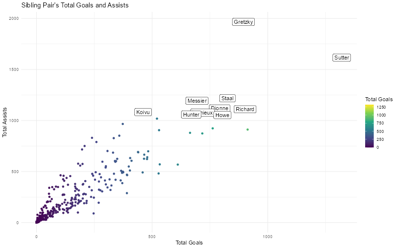
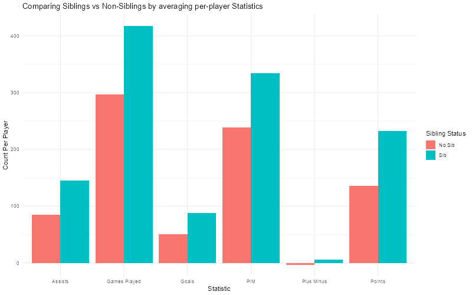
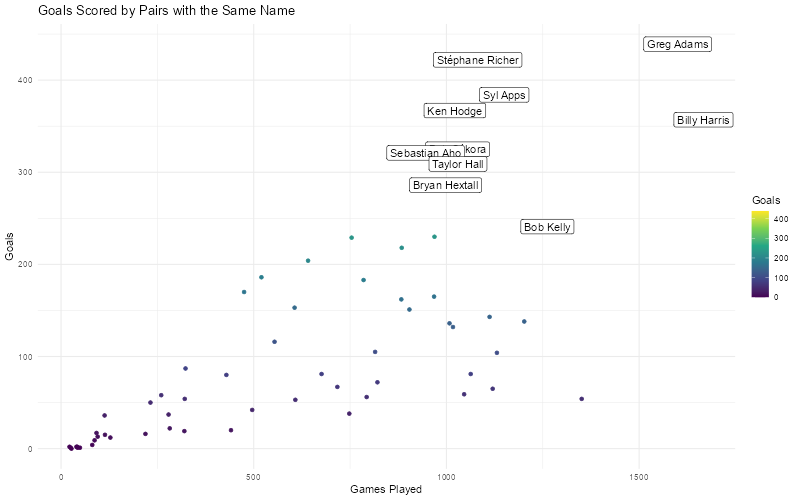

# NHL Relationship Overview

### Data

For this project there are 2 data sets. First we used skater data
scraped from Hockey Reference which has a complete list of all skaters
in NHL history, goalies are not included as they have a different
skillset and statistical profile. This data set has 7898 rows and 24
columns, each row representing a player and their career statistics.
This data set holds player information dating back to 1918 so the data
set is not fully complete, with not all statistics collected for the
entire history of the NHL. For instance, advanced statistics like plus
minus, time on ice, or even strength goals are not collected for the
early years of players. The other data set used is scraped from
Wikipedia and is a list of all all siblings who have played in the NHL
with an ID to determine which set of siblings each player belongs to.
This data set has 711 rows and 5 columns, with each row containing 1
player from each set of siblings, along with the family name, id, and
country of orgin for some players.

NHL Statistic Descriptions:

G: Goals Scored  A: Assists  PTS: Points = Goals + Assists 
PIM: Penalty Minutes  pm: Plus Minus = Team Goals Scored while on
ice - Goals against while on ice  GP: Game Played 

             player start_year end_year position  GP  G   A PTS plus_minus PIM
    1  George Allen       1939     1947     LW/D 340 82 115 197         NA 181
    2 Morgan Barron       2021     2026        C 321 41  42  83         22 111
      even_str_G pp_G sh_G gw_G even_str_A pp_A sh_A shots_on_goal shooting_pct
    1         66   14    2   15         95   20    0            NA           NA
    2         36    0    5    7         38    2    2           426          9.6
       TOI     ATOI  OPS  DPS   PS  X Country family id  sib
    1   NA     <NA> 13.2 14.5 27.7 33  Canada  Allen 33 sib1
    2 3701 11:32:00  1.7  5.3  7.0 39  Canada Barron 39 sib1

### Questions

Some of the questions we hope to answer in this project are:

What Siblings are the most succesful in NHL history? The most violent?

Are players with sibling in the NHL more successful than players
without?

From answering these questions we discovered a trend of players with the
exact same name and decided to explore another question,

What is the best pair of players with the exact same name?

### Best NHL Siblings

### Per Player Siblings vs. Non-Siblings

### Players with the Same Name

